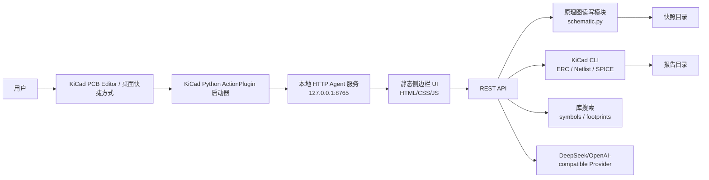

# KiCad AI Agent 开发维护手册

生成日期：2026-06-17  
适用项目：Windows 平台 KiCad AI Agent Beta  
当前本地版本：`0.2.0b1`  
当前开发机用户：`Sellen`

---

## 1. 项目定位

本项目目标是在 Windows 平台为开源电路设计软件 KiCad 构建一个类似 VS Code Copilot / 编程 Agent 的本地 AI 助手。用户可以通过自然语言与 Agent 交流，完成 KiCad 工程理解、原理图特征读取、元件参数修改、ERC 解释、netlist / SPICE 导出、模型 API 调用、插件启动等操作。

当前 Beta 版本采用“KiCad 插件启动器 + 本地 HTTP Agent 服务 + Edge App Mode 侧边栏窗口”的实现方式。它还不是 KiCad 原生 Dock Panel，但已经具备可验证的端到端链路：

- 从 KiCad PCB Editor 工具菜单启动 Agent。
- 打开类似侧边栏的深色 GUI。
- 读取当前 `.kicad_pro` / `.kicad_sch`。
- 抽取原理图结构特征并随对话上传给模型。
- 在侧边栏中配置 DeepSeek API Key 和模型。
- 解析自然语言修改意图。
- 自动生成可执行计划。
- 用户确认后直接写入 `.kicad_sch`。
- 执行前自动快照。
- 执行后通过 KiCad CLI 运行 ERC 和 netlist 校验。

---

## 2. 本机项目位置

### 2.1 Git 工作区

```text
C:\Users\Sellen\Documents\Codex\2026-06-16\windows-kicad-ai-agent-copilot-vs
```

### 2.2 KiCad 插件安装目录

```text
C:\Users\Sellen\AppData\Roaming\kicad\10.0\scripting\plugins\kicad_ai_agent_launcher
```

该目录由 `scripts\install_plugin.ps1` 从仓库中的插件源码复制生成。

### 2.3 KiCad 安装目录

```text
C:\Program Files\KiCad\10.0
```

关键可执行文件：

```text
C:\Program Files\KiCad\10.0\bin\python.exe
C:\Program Files\KiCad\10.0\bin\kicad-cli.exe
C:\Program Files\KiCad\10.0\bin\eeschema.exe
```

### 2.4 桌面快捷方式

```text
C:\Users\Sellen\Desktop\KiCad AI Agent.lnk
```

这个快捷方式用于补足 KiCad Schematic Editor 无法原生加载 Python ActionPlugin 的限制。它会启动最近一次记录的 KiCad 工程；如果没有记录，则弹出文件选择框，让用户选择 `.kicad_pro` 或 `.kicad_sch`。

### 2.5 本地运行时目录

```text
work\stage1_runtime
work\stage2_runtime
```

用途：

- `work\stage1_runtime\settings.json`：侧边栏模型配置和 API Key。
- `work\stage1_runtime\snapshots`：修改原理图前自动创建的快照。
- `work\stage1_runtime\reports`：ERC / netlist / SPICE 等 KiCad CLI 生成的报告。
- `work\stage2_runtime\last_project.txt`：最近一次由 KiCad 插件记录的工程路径。
- `work\stage2_runtime\logs\kicad_plugin_launch.log`：插件启动命令和工程路径日志。

---

## 3. GitHub 与发布状态

远程仓库：

```text
https://github.com/SellenChen/kicad-ai-agent
```

已发布 Beta Release：

```text
https://github.com/SellenChen/kicad-ai-agent/releases/tag/v0.2.0-beta.1
```

重要说明：

- GitHub Release 对应的是较早的 Beta 包。
- 后续针对深色侧边栏、DeepSeek 配置、Thinking UI、直接执行能力、安装脚本、桌面入口等改进，目前按用户要求尚未上传 GitHub。
- 当前本地工作区存在未提交改动，后续如果要继续正式开发，建议先创建新分支并提交当前状态。

当前未提交/新增文件主要包括：

```text
M README.md
M app/kicad_ai_agent/provider.py
M app/kicad_ai_agent/schematic.py
M app/kicad_ai_agent/server.py
M app/kicad_plugin/kicad_ai_agent_launcher/config.py
M app/kicad_plugin/kicad_ai_agent_launcher/launcher.py
M app/scripts/self_test.py
M app/static/app.js
M app/static/index.html
M app/static/styles.css
M docs/install.zh-CN.md
?? app/kicad_ai_agent/features.py
?? app/kicad_ai_agent/settings.py
?? scripts/Start-KiCadAIAgent.ps1
?? scripts/install_plugin.ps1
?? docs/KiCad_AI_Agent_开发维护手册.zh-CN.md
```

---

## 4. 当前目录结构

```text
.
├─ app
│  ├─ kicad_ai_agent
│  │  ├─ __init__.py
│  │  ├─ diagnostics.py
│  │  ├─ features.py
│  │  ├─ kicad_cli.py
│  │  ├─ library.py
│  │  ├─ paths.py
│  │  ├─ provider.py
│  │  ├─ schematic.py
│  │  ├─ server.py
│  │  ├─ settings.py
│  │  └─ sexpr.py
│  ├─ kicad_plugin
│  │  ├─ launcher_smoke_test.py
│  │  └─ kicad_ai_agent_launcher
│  │     ├─ __init__.py
│  │     ├─ config.py
│  │     └─ launcher.py
│  ├─ samples
│  │  └─ amplifier-ac-stage1
│  ├─ scripts
│  │  └─ self_test.py
│  ├─ static
│  │  ├─ app.js
│  │  ├─ index.html
│  │  └─ styles.css
│  └─ run_agent.py
├─ docs
│  ├─ architecture.zh-CN.md
│  ├─ development.zh-CN.md
│  ├─ faq.zh-CN.md
│  ├─ install.zh-CN.md
│  ├─ quick-start.zh-CN.md
│  ├─ user-guide.zh-CN.md
│  └─ KiCad_AI_Agent_开发维护手册.zh-CN.md
├─ scripts
│  ├─ install_plugin.ps1
│  ├─ package_beta.ps1
│  ├─ publish_github.ps1
│  └─ Start-KiCadAIAgent.ps1
├─ work
│  ├─ stage0_cli
│  ├─ stage1_runtime
│  └─ stage2_runtime
├─ pyproject.toml
├─ README.md
├─ RELEASE_NOTES_zh-CN.md
└─ LICENSE
```

---

## 5. 技术架构总览



系统分为四层：

1. **启动层**：KiCad 插件或桌面快捷方式负责启动本地服务和侧边栏窗口。
2. **Web UI 层**：`app/static` 提供深色侧边栏界面。
3. **Agent 服务层**：`server.py` 提供 REST API、对话状态、工具调用、校验闭环。
4. **KiCad 操作层**：`schematic.py`、`kicad_cli.py`、`library.py` 负责实际工程读写和校验。

---

## 6. 开发全过程日志

### 6.1 方案阶段

用户提出目标：

- 开发 Windows 平台 KiCad AI Agent。
- 产品形态类似 Copilot 在 VS Code 中的侧边栏。
- 通过自然语言完成原理图搭建、工程管理、电路仿真等操作。
- 可接入 DeepSeek 等模型 API。

最初技术路线确定为：

- 不直接改造 KiCad 主程序源码。
- 采用 KiCad Python 插件作为启动入口。
- 本地启动一个 Agent 服务。
- 通过 Web UI 作为侧边栏原型。
- 先实现可验证的文件读写、快照、ERC / netlist 校验闭环。
- 后续再探索 KiCad 原生 Dock Panel 或更深层插件集成。

### 6.2 阶段 0：可行性验证

阶段目标：

- 确认 KiCad CLI 可用。
- 读取示例 KiCad 工程。
- 解析 `.kicad_sch`。
- 生成工程摘要。
- 验证 ERC / netlist 能通过脚本调用。

结果：

- 成功定位 KiCad 10.0.x 安装目录。
- 成功读取 `work\stage0_cli` 下的 KiCad 工程。
- 成功实现 `.kicad_sch` S-expression 基础解析。
- 成功通过 KiCad CLI 运行 ERC / netlist。
- 形成阶段 0 文档，包含结果、项目结构、开发日志和后续规划。

### 6.3 阶段 1：本地 Agent 服务与基础工具

阶段目标：

- 搭建 Python 包结构。
- 实现本地 HTTP 服务。
- 实现静态 Web UI。
- 增加原理图摘要、ERC 解释、SPICE/netlist 导出、符号/封装搜索。
- 实现保留格式的原理图 Value 修改。

实现结果：

- `app/kicad_ai_agent/server.py` 提供 REST API。
- `app/static` 提供侧边栏页面。
- `schematic.py` 能定位元件 Reference 并修改指定 property。
- 修改前调用 `create_snapshot` 保存快照。
- 修改后调用 `validate_schematic` 执行 ERC 和 netlist。
- `library.py` 支持 KiCad 安装目录下符号库和封装库搜索。

### 6.4 阶段 1 收尾：KiCad 插件启动器

阶段目标：

- 让用户从 KiCad 中启动 Agent。

关键问题：

- 初版插件使用了 `sys.executable`，在 KiCad 中会把 `run_agent.py --project ...` 当成 KiCad 自身参数，弹出 `Unknown long option 'project'`。

修复方式：

- 插件改用 KiCad 自带 Python：

```text
C:\Program Files\KiCad\10.0\bin\python.exe
```

- 插件启动命令固定为：

```text
python.exe app\run_agent.py --project <project> --host 127.0.0.1 --port 8765
```

结果：

- PCB Editor 中 `工具 > KiCad AI Agent` 可正常启动。
- `http://127.0.0.1:8765` 可访问。

### 6.5 阶段 2：Beta 版本

阶段目标：

- 做出可验证可用的 Beta。
- 上传 GitHub。
- 创建 Release。
- 提供中文使用文档。

结果：

- 完成 Beta 版本打包。
- 创建 GitHub 仓库。
- 上传 Release：

```text
v0.2.0-beta.1
```

### 6.6 Beta 接入 KiCad 后的问题修复

用户反馈：

- 点击插件后弹窗：
  - `Unknown long option 'project'`
  - `run_agent.py 似乎不是 KiCad 工程文件`
- `http://127.0.0.1:8765` 无法打开。

根因：

- 插件进程启动方式不对，KiCad 没有用 Python 解释脚本，而是把参数交给了 KiCad 程序。

修复：

- `launcher.py` 中 `_python_executable` 优先使用 KiCad 自带 Python。
- 安装目录中的插件刷新。
- 重新启动 Agent 服务。

### 6.7 深色侧边栏与模型配置改进

用户要求：

- 改成 copilot-like 侧边栏形式。
- 改成黑夜模式 GUI。
- 模型下拉菜单当前包含 DeepSeek 可选项。
- 可在侧边栏输入 API Key 和配置。
- 增强原理图特征识别并随 API 上传。
- 改进安装体验，减少命令行步骤。

实现：

- `app/static/index.html`：重构侧边栏布局。
- `app/static/styles.css`：深色主题、固定顶部/底部、聊天区独立滚动。
- `app/static/app.js`：设置加载、保存、模型选择、对话历史、Thinking 状态、工具按钮。
- `settings.py`：本地保存 DeepSeek 配置。
- `features.py`：抽取原理图特征。
- `provider.py`：DeepSeek/OpenAI-compatible 调用。
- `scripts/install_plugin.ps1`：安装插件并生成桌面快捷方式。

### 6.8 Thinking UI、固定输入区、上下文确认问题修复

用户反馈：

- 发送消息后没有“思考中”提示。
- 输入框会被聊天滚动带走。
- 侧边栏窗口大小不合适。
- 模型上一步问是否执行，用户回复“执行”，Agent 未识别上下文。

实现：

- 前端新增 `[模型名] Thinking...` 和 spinner。
- 页面整体 `overflow: hidden`，只有 `#chatLog` 滚动。
- Edge App Mode 启动参数设置为：

```text
--window-size=430,920
--window-position=1480,40
```

- 前端维护 `state.history`。
- 服务端维护 `AgentState.last_plan`。
- 用户回复 `执行 / 直接帮我执行 / ok / yes` 时，服务端直接执行上一条可执行计划。

### 6.9 “Agent 不能直接执行”问题修复

用户反馈：

- Agent 仍然回复“无法直接修改 KiCad 文件”，没有实际执行。

根因：

- 旧版本只支持 `schematic.set_property` 类型计划。
- 模型生成的“新增元件表格”没有转换为工具计划。
- 服务端没有在确认语中强制执行上一条计划。

修复：

- `schematic.py` 增加：
  - `plan_parts_from_text`
  - `add_parts_preserving_format`
  - `_symbol_block`
- `server.py` 增加：
  - `/api/tools/add-parts/apply`
  - `_execute_plan`
  - `_is_execution_confirmation`
  - `last_plan` 存储。
- `app.js` 增加：
  - 对 `schematic.add_parts` 的执行分支。
  - 对确认语的前端识别。

当前直接执行能力：

- 能修改已有元件 Value。
- 能根据模型返回的 Markdown 表格新增元件实例。
- 新增元件当前只放置符号实例，不自动连线。
- 每次真实写入前自动创建快照。

### 6.10 Schematic Editor 工具菜单问题

用户反馈：

- 插件只能在 PCB Editor 的工具菜单找到。
- 原理图编辑器中找不到。

排查结果：

- 本机 KiCad 10 有：

```text
C:\Program Files\KiCad\10.0\bin\eeschema.exe
C:\Program Files\KiCad\10.0\bin\_eeschema.dll
```

- 但 KiCad Python 环境可用的是 `pcbnew.ActionPlugin`。
- `eeschema` Python 模块不可导入。
- KiCad 示例中的 Python ActionPlugin 也集中在 `pcbnew`。

结论：

- KiCad 10 当前 Python ActionPlugin 机制不能像 PCB Editor 一样原生挂到 Schematic Editor 工具菜单。

解决方案：

- 保留 PCB Editor 中的插件入口。
- 插件每次启动时写入 `work\stage2_runtime\last_project.txt`。
- 新增桌面快捷方式 `KiCad AI Agent.lnk`。
- 从原理图工作流中可通过桌面快捷方式启动同一工程的 Agent。

---

## 7. 核心模块说明

### 7.1 `app/run_agent.py`

最薄入口文件：

```python
from kicad_ai_agent.server import main
```

运行方式：

```powershell
cd app
python .\run_agent.py --project <工程.kicad_pro> --host 127.0.0.1 --port 8765
```

### 7.2 `server.py`

职责：

- 启动本地 HTTP 服务。
- 托管静态前端。
- 管理当前工程状态。
- 调用模型 provider。
- 生成和执行工具计划。
- 调用原理图读写、KiCad CLI、库搜索、快照恢复等功能。

核心类：

```python
class AgentState:
    project_path
    settings
    provider
    last_plan
```

关键点：

- `last_plan` 用于解决“上一步问是否执行，用户回复执行”的上下文问题。
- 每次 `/api/chat` 会重新加载设置，确保侧边栏保存 API Key 后立即生效。
- 如果 `upload_schematic_features=True`，会把 `features.py` 提取的工程特征作为 system message 传给模型。

### 7.3 `schematic.py`

职责：

- 定位 `.kicad_sch`。
- 解析工程摘要。
- 按 Reference 修改元件属性。
- 生成修改前快照。
- 从模型回复表格中解析新增元件计划。
- 向 `.kicad_sch` 追加简单符号实例。

重要函数：

```python
find_schematic(project_path)
summary(schematic_path)
parse_value_request(prompt)
plan_from_prompt(project_path, prompt)
set_property_preserving_format(...)
create_snapshot(...)
restore_snapshot(...)
plan_parts_from_text(project_path, text)
add_parts_preserving_format(schematic_path, parts)
```

修改 Value 的实现方式：

1. 使用正则查找 `(property "Reference" "R4")`。
2. 从该位置向前查找所属 `(symbol ...)` 起点。
3. 用 `_matching_paren` 找到完整 symbol 块。
4. 在 symbol 块中定位 `(property "Value" "...")` 的值区域。
5. 只替换值字符串，不重写整个 S-expression。
6. 写入前创建快照。

新增元件的实现方式：

1. 从模型回复的 Markdown 表格中解析：

```text
| 参考位 | 值 | 封装 | 符号库 |
| R900 | 10K | | Device:R |
```

2. 过滤已经存在的 Reference。
3. 用 `_symbol_block` 生成 KiCad symbol 实例。
4. 追加到 `.kicad_sch` 根节点闭合括号前。
5. 写入前创建快照。

限制：

- 只新增符号实例。
- 不自动连线。
- 不自动布局。
- 不自动补全复杂多单元器件的全部单元。

### 7.4 `sexpr.py`

职责：

- 轻量解析 KiCad S-expression。
- 提供 `parse`、`walk`、`head`、`properties`。

该模块用于摘要读取，不用于完整重写 KiCad 文件。实际写入采用保留格式的文本局部替换。

### 7.5 `kicad_cli.py`

职责：

- 调用 KiCad CLI。
- 生成 ERC JSON 报告。
- 导出 netlist。
- 导出 SPICE netlist。
- 运行 PCB DRC 的预留函数。

默认 KiCad CLI 路径：

```text
C:\Program Files\KiCad\10.0\bin\kicad-cli.exe
```

可用环境变量覆盖：

```text
KICAD_AGENT_KICAD_CLI
```

关键函数：

```python
erc(schematic_path)
export_netlist(schematic_path, fmt="kicadsexpr")
drc(board_path)
validate_schematic(schematic_path)
```

### 7.6 `features.py`

职责：

- 抽取用于上传给模型的原理图上下文特征。

输出内容：

- 原理图路径。
- KiCad schematic version。
- 符号、库符号、连线、标签、元件数量。
- 元件族分布，例如 `R`、`C`、`U`、`Q`。
- 高频 value。
- 电源符号。
- 有源器件。
- 元件列表，默认最多 120 个。

### 7.7 `settings.py`

职责：

- 保存和读取侧边栏模型设置。

设置文件：

```text
work\stage1_runtime\settings.json
```

当前模型列表：

```text
deepseek-v4-pro
deepseek-v4-flash
```

默认设置：

```json
{
  "provider": "deepseek",
  "model": "deepseek-v4-pro",
  "base_url": "https://api.deepseek.com",
  "api_key": "",
  "upload_schematic_features": true,
  "max_feature_components": 120
}
```

安全注意：

- `/api/settings` 返回时会清空 `api_key` 字段，只返回 `api_key_set`。
- API Key 当前保存为本地明文 JSON。后续应改为 Windows Credential Manager 或 DPAPI。

### 7.8 `provider.py`

职责：

- 抽象模型调用。
- 无 API Key 时使用 `MockProvider`。
- 有 API Key 时使用 OpenAI-compatible HTTP API。

DeepSeek 调用方式：

```text
POST https://api.deepseek.com/chat/completions
Authorization: Bearer <api_key>
Content-Type: application/json
```

请求体：

```json
{
  "model": "deepseek-v4-pro",
  "messages": [...],
  "stream": false
}
```

### 7.9 `library.py`

职责：

- 搜索 KiCad 标准符号库和封装库。

默认搜索根目录：

```text
C:\Program Files\KiCad\10.0\share\kicad\symbols
C:\Program Files\KiCad\10.0\share\kicad\footprints
```

当前实现是文件名级搜索，不读取符号内部定义。

### 7.10 `diagnostics.py`

职责：

- 输出本机环境诊断。
- 检查工程路径、KiCad CLI 是否存在、运行时目录等。

### 7.11 `paths.py`

职责：

- 统一定义仓库、静态文件、运行时数据、快照、报告、KiCad CLI 路径。

关键路径：

```python
REPO_ROOT = Path(__file__).resolve().parents[2]
APP_ROOT = REPO_ROOT / "app"
STATIC_ROOT = APP_ROOT / "static"
DATA_ROOT = REPO_ROOT / "work" / "stage1_runtime"
SNAPSHOT_ROOT = DATA_ROOT / "snapshots"
REPORT_ROOT = DATA_ROOT / "reports"
```

---

## 8. REST API 说明

### 8.1 页面与健康检查

| 方法 | 路由 | 说明 |
|---|---|---|
| GET | `/` | 返回侧边栏 HTML |
| GET | `/static/...` | 静态资源 |
| GET | `/api/health` | 服务健康检查 |

### 8.2 工程读取

| 方法 | 路由 | 说明 |
|---|---|---|
| GET | `/api/project` | 当前工程路径和原理图路径 |
| GET | `/api/project/summary` | 原理图摘要 |
| GET | `/api/project/features` | 上传给模型的原理图特征 |
| GET | `/api/file?path=...` | 读取指定文件文本 |

### 8.3 对话与模型

| 方法 | 路由 | 说明 |
|---|---|---|
| POST | `/api/chat` | 发送用户消息，调用模型并生成计划 |
| GET | `/api/settings` | 获取模型设置和可选模型 |
| POST | `/api/settings` | 保存模型设置 |

`/api/chat` 请求示例：

```json
{
  "message": "把 R4 改成 2K",
  "history": [
    {"role": "user", "content": "..."},
    {"role": "assistant", "content": "..."}
  ]
}
```

可能返回：

```json
{
  "ok": true,
  "reply": {"content": "..."},
  "plan": {
    "ok": true,
    "tool": "schematic.set_property",
    "arguments": {
      "reference": "R4",
      "property": "Value",
      "old_value": "1K",
      "new_value": "2K"
    },
    "validation": ["erc", "netlist"]
  }
}
```

如果用户随后发送：

```text
直接帮我执行
```

服务端会执行 `AgentState.last_plan`。

### 8.4 工具执行

| 方法 | 路由 | 说明 |
|---|---|---|
| POST | `/api/tools/set-value/preview` | 预览元件 Value 修改 |
| POST | `/api/tools/set-value/apply` | 执行元件 Value 修改并校验 |
| POST | `/api/tools/add-parts/apply` | 新增元件实例并校验 |

### 8.5 KiCad CLI

| 方法 | 路由 | 说明 |
|---|---|---|
| POST | `/api/validate` | ERC + netlist |
| POST | `/api/export/spice` | 导出 SPICE netlist |
| POST | `/api/erc/explain` | 分组解释 ERC 报告 |

### 8.6 库搜索与快照

| 方法 | 路由 | 说明 |
|---|---|---|
| POST | `/api/library/symbols` | 搜索符号库 |
| POST | `/api/library/footprints` | 搜索封装库 |
| GET | `/api/snapshots` | 列出快照 |
| POST | `/api/snapshots/restore` | 从快照恢复 |
| GET | `/api/reports` | 列出报告文件 |

---

## 9. 前端 GUI 实现

前端位于：

```text
app\static
```

文件：

- `index.html`：页面结构。
- `styles.css`：深色侧边栏样式。
- `app.js`：状态管理、API 调用、对话和工具执行。

当前 UI 分区：

1. 顶部标题和当前工程路径。
2. 模型配置区：
   - DeepSeek 模型下拉框。
   - API Key 输入框。
   - 保存按钮。
   - 是否上传原理图特征的复选框。
3. 工程摘要卡片：
   - 符号数。
   - 连线数。
   - 标签数。
   - 原理图版本。
4. 聊天记录区：
   - 独立滚动。
   - 输入区不会被滚走。
   - 请求中显示 `[模型名] Thinking...` 和旋转图标。
5. 工具按钮：
   - 特征。
   - ERC。
   - 解释。
   - SPICE。
   - 快照。
6. 搜索栏：
   - 符号搜索。
   - 封装搜索。
7. 计划面板：
   - 显示可执行计划 JSON。
   - 预览。
   - 执行并校验。
8. 底部输入区：
   - Enter 发送。
   - Shift + Enter 换行。

---

## 10. KiCad 插件实现

插件源码：

```text
app\kicad_plugin\kicad_ai_agent_launcher
```

安装目标：

```text
%APPDATA%\kicad\10.0\scripting\plugins\kicad_ai_agent_launcher
```

核心文件：

```text
launcher.py
config.py
__init__.py
```

### 10.1 `launcher.py`

继承：

```python
pcbnew.ActionPlugin
```

默认信息：

```text
name = KiCad AI Agent
category = AI Assistant
description = Launch the KiCad AI Agent side panel
show_toolbar_button = True
```

启动流程：

1. 获取当前 PCB 对应的工程路径。
2. 生成命令：

```text
C:\Program Files\KiCad\10.0\bin\python.exe app\run_agent.py --project <project> --host 127.0.0.1 --port 8765
```

3. 写入启动日志和最近工程路径。
4. 检查服务是否已健康。
5. 未启动则后台启动。
6. 用 Edge App Mode 打开侧边栏窗口。

### 10.2 为什么不能直接出现在 Schematic Editor 工具菜单

实际排查结果：

- `pcbnew.ActionPlugin` 可用。
- `eeschema` Python 模块不可用。
- KiCad 10 示例脚本也只展示 PCB 侧 ActionPlugin。

因此当前方案不能把 Python ActionPlugin 原生挂入 Schematic Editor 工具菜单。当前替代方案是桌面快捷方式。

---

## 11. 安装与启动

### 11.1 安装插件和桌面入口

在项目根目录运行：

```powershell
C:\Windows\System32\WindowsPowerShell\v1.0\powershell.exe -ExecutionPolicy Bypass -File .\scripts\install_plugin.ps1
```

该脚本会：

1. 删除旧插件目录。
2. 复制 `app\kicad_plugin\kicad_ai_agent_launcher` 到 KiCad 用户插件目录。
3. 创建桌面快捷方式：

```text
C:\Users\Sellen\Desktop\KiCad AI Agent.lnk
```

### 11.2 从 PCB Editor 启动

1. 重启 KiCad PCB Editor。
2. 点击：

```text
工具 > KiCad AI Agent
```

3. 插件会启动本地服务并打开侧边栏窗口。

### 11.3 从 Schematic Editor 工作流启动

由于 KiCad 10 的 Python ActionPlugin 限制，Schematic Editor 里没有原生菜单入口。

使用：

```text
C:\Users\Sellen\Desktop\KiCad AI Agent.lnk
```

如果最近工程已记录，会自动打开最近工程；否则弹出文件选择框。

### 11.4 手动启动服务

```powershell
cd C:\Users\Sellen\Documents\Codex\2026-06-16\windows-kicad-ai-agent-copilot-vs
cd app
python .\run_agent.py --project ..\work\stage0_cli\pic_programmer\pic_programmer.kicad_pro --host 127.0.0.1 --port 8765
```

访问：

```text
http://127.0.0.1:8765
```

---

## 12. 开发与验证命令

### 12.1 编译检查

```powershell
python -m py_compile app\kicad_ai_agent\server.py app\kicad_ai_agent\schematic.py app\kicad_ai_agent\provider.py app\scripts\self_test.py
```

### 12.2 快速解析检查

```powershell
python -c "from app.kicad_ai_agent.server import _is_execution_confirmation; from app.kicad_ai_agent.schematic import parse_value_request; print(_is_execution_confirmation('直接帮我执行')); print(parse_value_request('把 R4 改成 2K'))"
```

期望输出：

```text
True
('R4', '2K')
```

### 12.3 完整自测

```powershell
python app\scripts\self_test.py
```

当前最近一次验证结果：

```text
health.ok = true
version = 0.2.0b1
settings_models = deepseek-v4-pro, deepseek-v4-flash
feature_component_count = 37
chat_plan.tool = schematic.set_property
R4 old_value = 1K
R4 new_value = 2K
set-value netlist_ok = true
add_parts.changed = true
added = R900 / 10K / Device:R
add-parts netlist_ok = true
erc_explain_groups = 6
symbol_search_results = 3
footprint_search_results = 30
diagnostics_cli_exists = true
```

说明：

- 自测会复制 `work\stage0_cli\amplifier-ac` 到 `app\samples\amplifier-ac-stage1`。
- 自测会临时清空本地设置中的 API Key，避免误调 DeepSeek。
- 自测结束会恢复原 `settings.json`。

### 12.4 检查当前运行服务

```powershell
Invoke-RestMethod -Uri http://127.0.0.1:8765/api/health
Invoke-RestMethod -Uri http://127.0.0.1:8765/api/project
```

### 12.5 停止旧 Agent 服务

只停止本项目的 `run_agent.py` 进程：

```powershell
Get-CimInstance Win32_Process |
  Where-Object { $_.Name -like 'python*.exe' -and $_.CommandLine -like '*windows-kicad-ai-agent-copilot-vs*run_agent.py*' } |
  ForEach-Object { Stop-Process -Id $_.ProcessId -Force }
```

---

## 13. 数据与文件格式

### 13.1 可执行计划：修改 Value

```json
{
  "ok": true,
  "requires_confirmation": true,
  "tool": "schematic.set_property",
  "arguments": {
    "schematic": "C:\\path\\project.kicad_sch",
    "reference": "R4",
    "property": "Value",
    "old_value": "1K",
    "new_value": "2K"
  },
  "validation": ["erc", "netlist"]
}
```

### 13.2 可执行计划：新增元件

```json
{
  "ok": true,
  "requires_confirmation": true,
  "tool": "schematic.add_parts",
  "arguments": {
    "schematic": "C:\\path\\project.kicad_sch",
    "parts": [
      {
        "ref": "R900",
        "value": "10K",
        "footprint": "",
        "lib_id": "Device:R"
      }
    ],
    "skipped_existing": []
  },
  "validation": ["erc", "netlist"]
}
```

### 13.3 快照格式

快照目录：

```text
work\stage1_runtime\snapshots\<timestamp>-<schematic_name>
```

元数据：

```json
{
  "created_at": "20260617-123456",
  "reason": "set R4.Value to 2K",
  "source": "C:\\path\\project.kicad_sch",
  "snapshot": "C:\\path\\snapshot.kicad_sch",
  "project": "C:\\path\\project.kicad_pro"
}
```

---

## 14. 当前功能清单

### 14.1 已实现

- Windows 本地运行。
- KiCad PCB Editor 插件启动器。
- 桌面快捷方式启动器。
- Edge App Mode 类侧边栏窗口。
- 深色模式 GUI。
- DeepSeek 模型下拉选择。
- API Key 输入与保存。
- 原理图特征抽取并随对话上传。
- 对话历史传递。
- Thinking 状态提示。
- 固定顶部、工具区、输入区，聊天记录独立滚动。
- 原理图摘要读取。
- 自然语言修改 Value。
- 上下文确认执行。
- 修改前快照。
- 修改后 ERC + netlist 校验。
- ERC 报告解释。
- SPICE netlist 导出。
- 符号库搜索。
- 封装库搜索。
- 新增元件实例的初步工具执行。
- 插件安装脚本。
- 完整自测脚本。

### 14.2 部分实现

- 新增元件：
  - 已能写入符号实例。
  - 尚未自动连线和布局。
- Copilot-like 侧边栏：
  - 当前是 Edge App Mode 独立窄窗。
  - 尚不是 KiCad 原生 Dock Panel。
- 原理图编辑器入口：
  - 已提供桌面快捷方式替代。
  - 尚不能原生出现在 Schematic Editor 工具菜单。
- DeepSeek 调用：
  - 已支持 OpenAI-compatible API。
  - 尚未针对 DeepSeek 的工具调用协议做结构化 function calling。

### 14.3 未实现

- 自动放置符号到合理拓扑位置。
- 自动连线。
- 自动生成完整电路模块。
- PCB 布局修改。
- DRC 闭环入口。
- 原生 KiCad Dock Panel。
- Windows Credential Manager 存储 API Key。
- 多模型 Provider 扩展 UI。
- 流式输出。
- 复杂多轮工具规划。
- 自动生成 BOM。
- 自动封装分配。
- 自动仿真运行和波形解释。

---

## 15. 已知风险与维护注意事项

### 15.1 KiCad 文件写入风险

当前写入 `.kicad_sch` 的方式是文本局部替换和追加 symbol block。优点是保留大部分原始格式；风险是对复杂 KiCad 文件结构的覆盖范围有限。

维护建议：

- 新增任何写入能力前必须创建快照。
- 写入后必须跑 `validate_schematic`。
- 新功能先在样例工程副本中验证。
- 不要直接在用户工程上批量试验。

### 15.2 新增元件能力仍是 Beta

`add_parts_preserving_format` 只追加 symbol 实例，不自动处理：

- 连线。
- Net label。
- 电源符号。
- 层级图纸。
- 多单元器件。
- 自动编号冲突之外的复杂冲突。

### 15.3 API Key 明文保存

当前 `settings.json` 明文保存 API Key。开发测试方便，但不适合正式产品。

后续建议：

- Windows DPAPI。
- Windows Credential Manager。
- 或本地加密配置。

### 15.4 端口与进程管理

默认端口：

```text
8765
```

桌面启动脚本会从 8765 开始寻找可用端口。如果 8765 已有同工程服务，会复用；如果被其他进程占用，会尝试后续端口。

KiCad 插件目前默认固定使用 8765。后续建议把插件也升级成“端口探测 + 打开实际端口”。

### 15.5 终端中文显示

Windows PowerShell 5 在某些代码页下会把 UTF-8 中文显示成乱码，但源码实际是 UTF-8。验证方式：

```powershell
python -c "from pathlib import Path; s=Path('app/kicad_ai_agent/server.py').read_text(encoding='utf-8'); print('执行' in s)"
```

输出应为：

```text
True
```

---

## 16. 后续开发路线

### 16.1 短期优先级

1. 把当前本地改进提交到新分支。
2. 修复 README 和旧 docs 中可能由终端显示造成的乱码展示问题，统一保存为 UTF-8。
3. 为新增元件能力增加更严格的单元测试。
4. 将 Agent 对模型的输出约束改为结构化 JSON 计划，而不是从 Markdown 表格中解析。
5. 增加工具执行确认 UI，例如“计划摘要 + 风险提示 + 快照路径”。
6. 将 API Key 存储迁移到 Windows Credential Manager。

### 16.2 中期目标

1. 实现自动放置和基础连线。
2. 支持原理图模块生成。
3. 支持 BOM、封装分配和封装检查。
4. 支持 PCB DRC 读取和解释。
5. 支持 SPICE 仿真执行和结果解释。
6. 增加多 Provider：
   - DeepSeek。
   - OpenAI。
   - 本地 Ollama。
   - 自定义 OpenAI-compatible endpoint。

### 16.3 长期目标

1. 探索 KiCad 原生 UI 扩展或 Dock Panel。
2. 构建 KiCad Agent 工具调用协议。
3. 支持复杂多步骤任务：
   - 需求理解。
   - 原理图生成。
   - 规则检查。
   - 修复。
   - PCB 布局建议。
   - 仿真验证。
4. 做成可发布的 KiCad Plugin and Content Manager 包。

---

## 17. 新开发者快速上手

### 17.1 准备环境

确认安装：

- Windows。
- KiCad 10.0.x。
- Python 3.11+。

进入项目：

```powershell
cd C:\Users\Sellen\Documents\Codex\2026-06-16\windows-kicad-ai-agent-copilot-vs
```

### 17.2 运行自测

```powershell
python app\scripts\self_test.py
```

如果自测通过，说明：

- 服务能启动。
- 原理图能解析。
- Value 修改能执行。
- 新增元件能执行。
- KiCad CLI 能运行 ERC / netlist。
- 库搜索能工作。

### 17.3 安装到 KiCad

```powershell
C:\Windows\System32\WindowsPowerShell\v1.0\powershell.exe -ExecutionPolicy Bypass -File .\scripts\install_plugin.ps1
```

### 17.4 手动调试服务

```powershell
cd app
python .\run_agent.py --project ..\work\stage0_cli\pic_programmer\pic_programmer.kicad_pro --host 127.0.0.1 --port 8765
```

浏览器打开：

```text
http://127.0.0.1:8765
```

### 17.5 常用调试入口

```text
GET  /api/health
GET  /api/project
GET  /api/project/summary
GET  /api/project/features
POST /api/chat
POST /api/validate
POST /api/tools/set-value/preview
POST /api/tools/set-value/apply
POST /api/tools/add-parts/apply
```

---

## 18. 当前维护结论

本项目已经从技术路线验证进入 Beta 可用状态。它的核心价值链路已经成立：

```text
KiCad 工程 -> Agent 读取上下文 -> 模型理解 -> 可执行计划 -> 用户确认 -> 写入原理图 -> 快照 -> ERC/netlist 校验
```

当前最值得继续投入的方向不是再扩大 UI，而是增强“工具计划”的确定性：

- 让模型输出强约束 JSON。
- 让执行器支持更多安全的 KiCad 操作。
- 让每次写入都可预览、可回滚、可验证。

只要保持“先计划、再确认、再快照、再执行、再校验”的开发纪律，这个项目可以稳步从 Beta 侧边栏演进成真正的 KiCad Copilot-like Agent。
